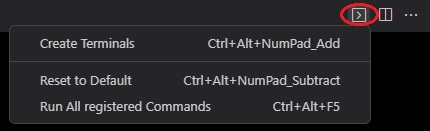
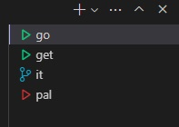
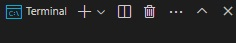
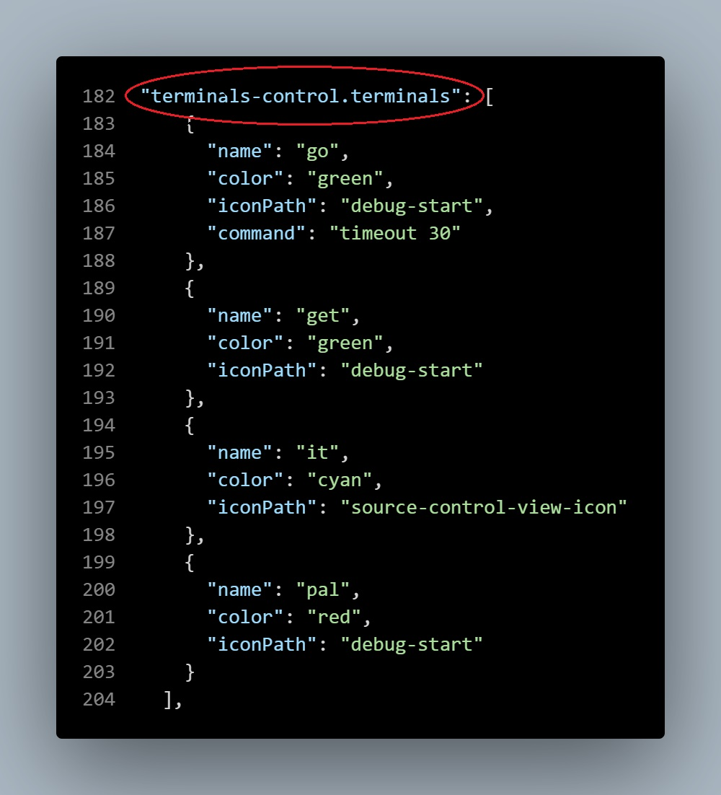
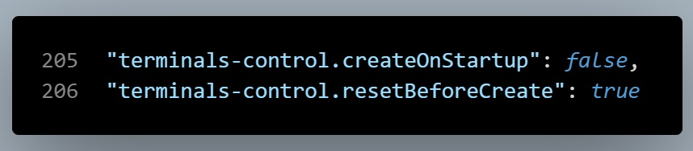

# Terminals Launcher

Add the ability to launch a pre-defined terminal profile list manually or on startup.

## Features

* **Adds a menu** on the editor's title bar 
* **Create Terminals** - Add terminals you pre-defined in settings.json.

* **Reset to Default** - Set terminals to VS-Code's default

* **Run All Registered Commands** - For each of your terminals run a pre-defined command, configured in settings.json

## Configuration
#### Terminal definitions
Terminals are defined using the **"terminals-control.terminals"** key:

* **"name"** - The title that will be displayed in the terminal list* - ***mandatory***
* **"color"** - Choose from VS Code's predefined pallete:
*Black,
Blue,
BrightBlue,
BrightCyan,
BrightGreen,
BrightMagenta,
BrightRed,
BrightWhite,
BrightYellow,
Cyan,
Green,
Magenta,
Red,
White,
Yellow*
* **"iconPath"** - Pick an icon from VS Code's [Icon Listing](https://code.visualstudio.com/api/references/icons-in-labels#icon-listing)
* **"command"** - Optional cmd to run when clicking *Run All Registered Commands* 

#### Additional settings

* **"teminals-control.createOnStartup"** - Your terminals will automatically be created on each new VS Code instance (default: false)
* **"teminals-control.resetBeforeCreate"** - Will delete current terminals before creating the new ones (default: true)

## Note

Currently only Windows console is supported

